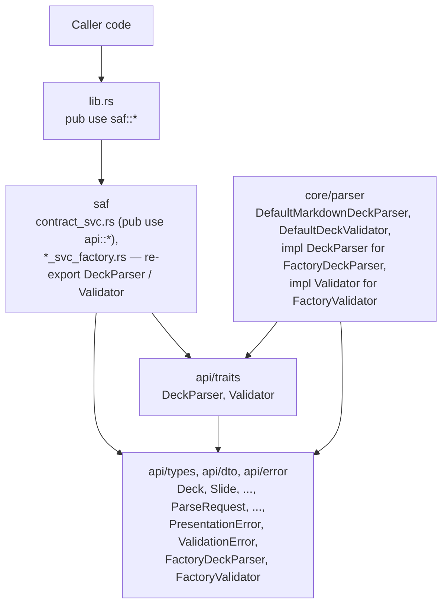
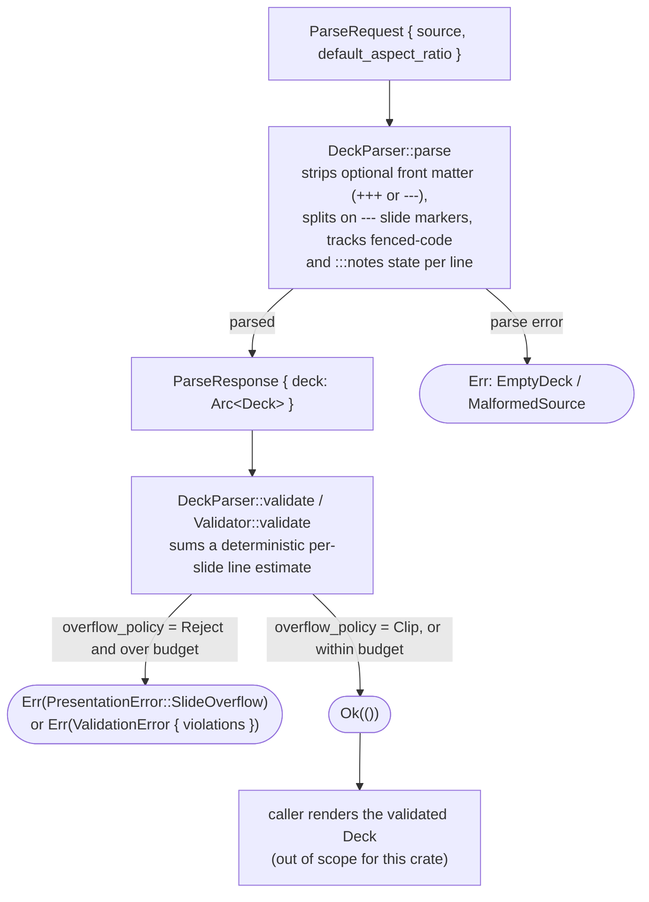

# Architecture

## What

`pdf-engine-presentation` is a single library crate structured in SEA
(port/adapter-style) layers:

- `api` — pure declarations, no logic:
  - `api/traits/` — `DeckParser` (parse + validate a deck) and `Validator`
    (generic itemized validation), each with a default `factory()` method.
  - `api/types/` — `Deck`, `Slide`, `SlideElement`, `AspectRatio`,
    `OverflowPolicy`; `api/types/factory/` — `FactoryDeckParser`,
    `FactoryValidator` — one type per file.
  - `api/dto/` — `ParseRequest`, `ParseResponse`, `ValidateRequest`, the
    request/response types `DeckParser`'s methods use.
  - `api/error/` — `PresentationError`, `ValidationError` (declarations only).
- `core/parser/` — the real logic: `DefaultMarkdownDeckParser` (implements
  `DeckParser`) and `DefaultDeckValidator` (implements `Validator`, adapting
  `DefaultMarkdownDeckParser`'s validation into `Validator`'s itemized-error
  shape). This is also where `FactoryDeckParser`/`FactoryValidator` (declared
  in `api/`) get their own `DeckParser`/`Validator` impls, each delegating to
  the `Default*` type — `saf/` must stay construction-only, so trait impls for
  `api/`-declared types live in `core/`, not `saf/`. `core/error/` holds
  `PresentationError`'s `Display`/`Error` impls.
- `saf` — construction only: `deck_parser_svc_factory.rs` and
  `validator_svc_factory.rs` each re-export their respective port trait
  (`DeckParser`, `Validator`) through the facade. The production
  implementations (`FactoryDeckParser`, `FactoryValidator`) are reachable via
  the crate root through `contract_svc.rs`'s existing `api::*` re-export.

`lib.rs` re-exports every public item from `saf`, so callers only ever import
from the crate root (`pdf_engine_presentation::{DeckParser, FactoryDeckParser,
ParseRequest, ...}`), never from `api`/`core`/`saf` directly — those module
names are an internal organizational detail, not part of the public API.

## Why

This crate is extracted from the `pdf-engine` monorepo's
`main/port/presentation` module, where it served as the "port" half of a
hexagonal port/adapter pair: `pdf-engine-presentation` defines the pure
parsing/validation contract, and a separate `pdf-engine-adapter-presentation`
crate (which stays inside the monorepo) implements Chromium-based PDF/HTML
rendering on top of it.

That split is why this crate has zero dependencies and no rendering code of
its own: parsing Markdown into a `Deck` and deciding whether it fits a fixed
canvas are both pure, deterministic, and independently useful — worth
depending on directly without pulling in a Chromium-based rendering pipeline.
Standing it up as its own crate makes that boundary a real one instead of an
internal convention: consumers who only need the parsing/validation contract
(for example, a project needing a similar dependency-free Markdown subset
parser) can depend on it from crates.io without a path/git dependency into a
private monorepo.

### Why a trait, not free functions

The crate originally exposed `parse_markdown`/`validate_deck` as free
functions. It now exposes them as the `DeckParser` trait, implemented
directly by `FactoryDeckParser`, for two reasons: the trait gives callers a substitutable
seam (a test double can stand in for `DeckParser` without touching real
parsing logic — see `tests/deck_parser_int_test.rs`), and it lets the crate's
internal layering keep all real logic inside `core/`, with `api/` staying a
pure, dependency-free contract surface.

### Why `Validator` as well as `DeckParser::validate`

`Validator::validate` and `DeckParser::validate` check the same fixed-canvas
constraint — `DefaultDeckValidator` (the default `Validator` implementation)
delegates directly to `DefaultMarkdownDeckParser::validate_deck` rather than
reimplementing it. `Validator` exists as a second, generic entry point
because it reports failures as itemized `ValidationError { violations:
Vec<String> }` diagnostics rather than `DeckParser`'s structured
`PresentationError` variants — useful for a caller that wants a uniform
validation shape across multiple unrelated checks, without needing to know
`PresentationError`'s specific variants.

## Determinism

`DefaultMarkdownDeckParser::parse` and `::validate` are both pure: same
input, same output, every time. There is no floating-point arithmetic, no
locale- or platform-dependent behavior, and no reliance on iteration order
that isn't already source order. The line-count estimate behind
`SlideOverflow`'s `estimated_lines` is an integer computation over `char`
counts and `\n`-delimited line counts — reproducible across platforms.

## Module data flow

## Error handling

`PresentationError` is declared in `api/error/presentation_error.rs`; its
`std::error::Error` and `Display` impls live in `core/error/display.rs` so
that `api/` stays declarations-only. `ValidationError` is a plain struct
wrapping `Vec<String>`. No `unwrap`/`expect` anywhere in the parser (enforced
by `#![deny(unsafe_code)]` at the crate level and `unwrap_used`/`expect_used
= "deny"` lint configuration in `Cargo.toml`). Every failure path returns a
`PresentationError` (or, through `Validator`, a `ValidationError`) with
enough context — the offending slide number, the estimated line count, or a
message — for a caller to act on without re-parsing the source.
