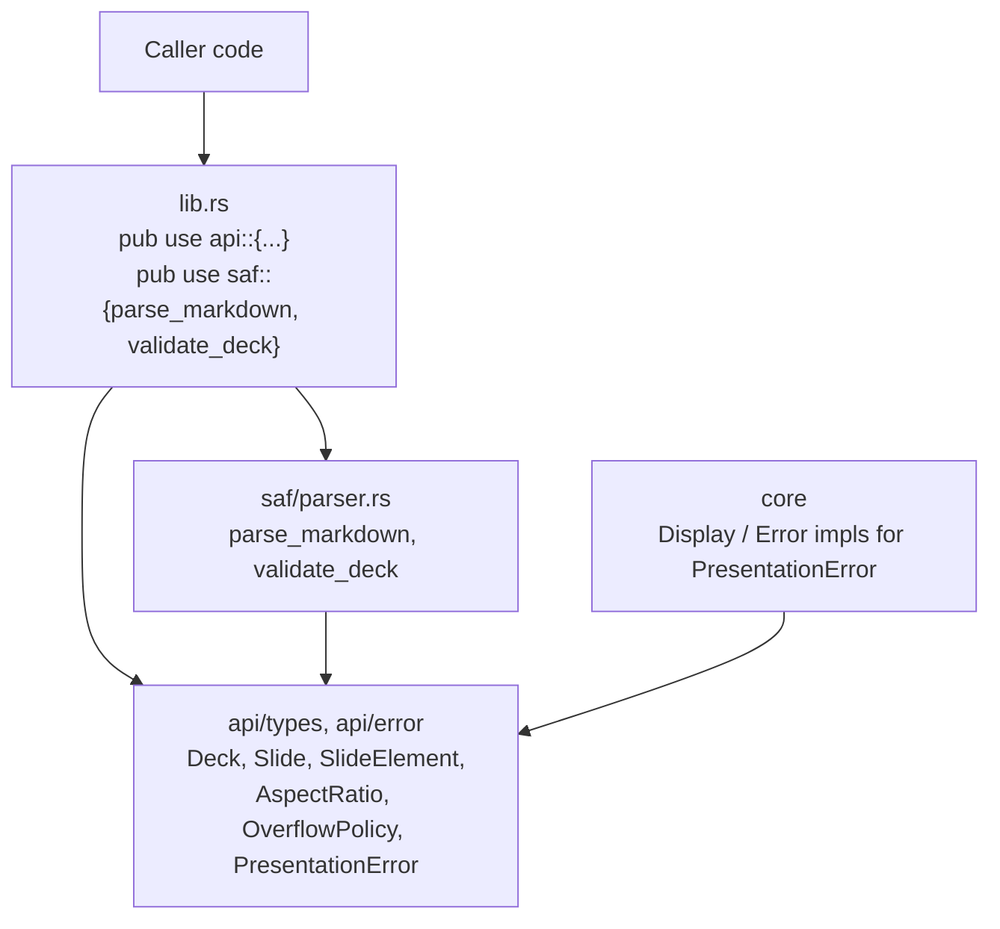
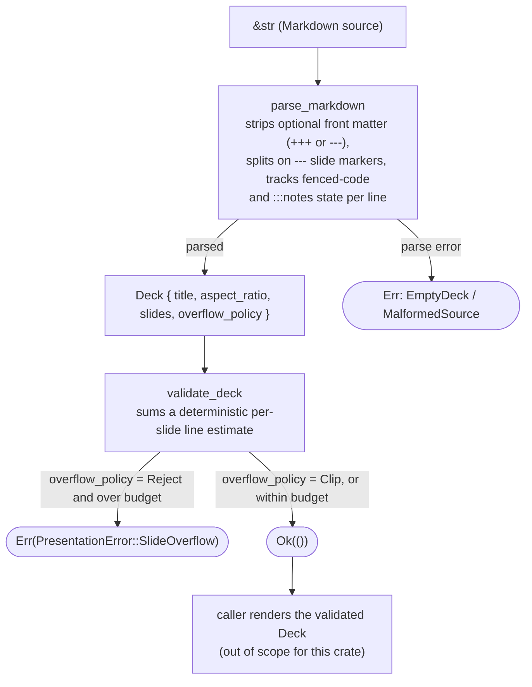

# Architecture

## What

`pdf-engine-presentation` is a single library crate with three modules:

- `api` — pure data declarations, one type per file: `api/types/` holds
  `Deck`, `Slide`, `SlideElement`, `AspectRatio`, `OverflowPolicy`; `api/error/`
  holds the `PresentationError` enum declaration. No logic, no impls.
- `core` — the `Display`/`std::error::Error` trait implementations for
  `PresentationError` (kept out of `api/`, which is declarations-only).
- `saf` — the parser and validator: `parser.rs` defines `parse_markdown`
  (source text → `Deck`) and `validate_deck` (`Deck` →
  `Result<(), PresentationError>`); `saf/mod.rs` itself only re-exports them.

`lib.rs` re-exports the public items from `api`, so callers only ever import
from the crate root (`pdf_engine_presentation::{parse_markdown, Deck, ...}`),
never from `api`/`core`/`saf` directly — those module names are an internal
organizational detail, not part of the public API.

## Why

This crate is extracted from the `pdf-engine` monorepo's
`main/port/presentation` module, where it served as the "port" half of a
hexagonal port/adapter pair: `pdf-engine-presentation` defines the pure
parsing/validation contract, and a separate `pdf-engine-adapter-presentation`
crate (which stays inside the monorepo) implements Chromium-based PDF/HTML
rendering on top of it.

That split is why this crate has zero dependencies and no rendering code of
its own: parsing Markdown into a `Deck` and deciding whether it fits a fixed
canvas are both pure, deterministic, and independently useful — worth
depending on directly without pulling in a Chromium-based rendering pipeline.
Standing it up as its own crate makes that boundary a real one instead of an
internal convention: consumers who only need the parsing/validation contract
(for example, a project needing a similar dependency-free Markdown subset
parser) can depend on it from crates.io without a path/git dependency into a
private monorepo.

## Determinism

`parse_markdown` and `validate_deck` are both pure functions: same input,
same output, every time. There is no floating-point arithmetic, no locale-
or platform-dependent behavior, and no reliance on iteration order that isn't
already source order. `validate_deck`'s line-count estimate
(`SlideOverflow`'s `estimated_lines`) is an integer computation over `char`
counts and `\n`-delimited line counts — reproducible across platforms.

## Module data flow

## Error handling

`PresentationError` is a plain enum declared in `api/error/presentation_error.rs`;
its `std::error::Error` and `Display` impls live in `core/presentation_error_display.rs`
so that `api/` stays declarations-only. No `unwrap`/`expect` anywhere in the parser (enforced by
`#![deny(unsafe_code)]` at the crate level and
`unwrap_used`/`expect_used = "deny"` lint configuration in `Cargo.toml`).
Every failure path returns a `PresentationError` variant with enough context
(the offending slide number, the estimated line count, or a message) for a
caller to act on without re-parsing the source.
